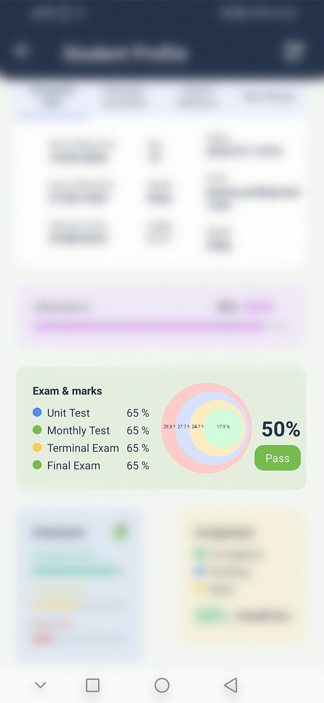
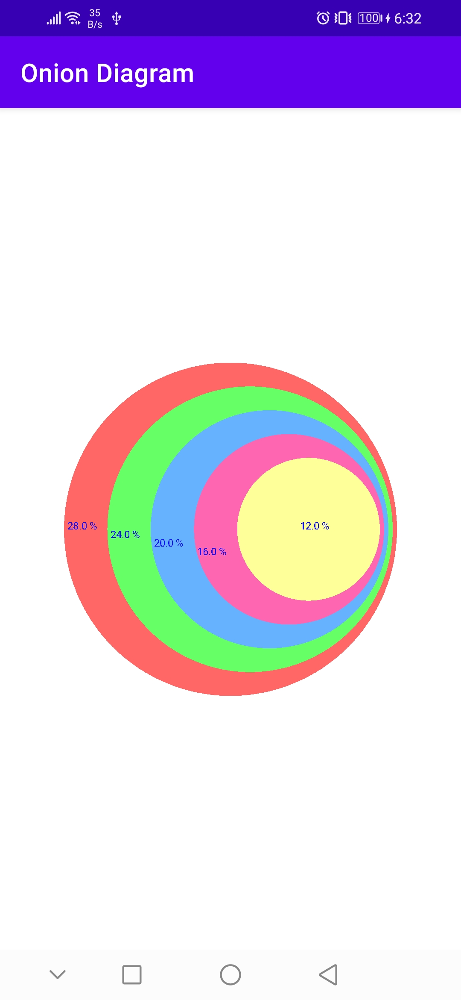

# Onion Diagram / Stacked Vann Diagram

Android library for onion diagram i.e also refered as stacked vann diagram


         
## Gradle


```bash
dependencies {
    ...
    implementation 'com.github.puskal-khadka:OnionDigram:1.0.1'
}
```

## Maven

```bash 
	<dependency>
	    <groupId>com.github.puskal-khadka</groupId>
	    <artifactId>OnionDigram</artifactId>
	    <version>1.0.1</version>
	</dependency>
```


## Usage

```bash
    <com.puskal.oniondiagram.OnionDiagramView
        android:id="@+id/viewOnion"
        android:layout_width="match_parent"
        android:layout_height="wrap_content"
        android:layout_margin="50dp"
        app:layout_constraintBottom_toBottomOf="parent"
        app:layout_constraintEnd_toEndOf="parent"
        app:layout_constraintStart_toStartOf="parent"
        app:layout_constraintTop_toTopOf="parent"
        app:onionTextAlign="differentRow"
        app:textColor="#1111ff"
        app:textSize="8sp"
        app:diagramType="CalculatedPrecise"
        />

```

## SetUp data
```java
     val onionDiagramView=findViewById<OnionDiagramView>(R.id.viewOnion)

     onionDiagramView.valueList=arrayListOf<Float>(300F, 200F,350F,150F,250F)

     //to give custom color
     //if you not define color list, default color will be shown, so you can
     //skip this color list
     val colorList= arrayListOf(
                     ContextCompat.getColor(requireContext(),R.color.red),
                     ContextCompat.getColor(requireContext(),R.color.green),
                     ContextCompat.getColor(requireContext(),R.color.yellow),
                 )
      
      

```

## PARAMETERS AND FUNCTIONS
* ```app:diagramType="CalculatedPrecise"```
  * This will show circle layer,radius according to data passed. This is Default

* ```app:diagramType="UniformDecreasing"```
  * This will show inner layer of uniform radius, size irrespective to data

* ```app:onionTextAlign="differentRow"```
  * text align will be down respective to another text instead of same line. This 
     default

* ```app:onionTextAlign="sameRow"```
  * it will show text in layer that will align in same row

* ```app:textColor="#11ffff"```
  * to change text color. Default color is black 

* ``` app:textSize="8sp" ```
  * to change text size. Default size 14sp

       


        

        

## Contributing
Pull requests are welcome. For major changes, please open an issue first to discuss what you would like to change.
